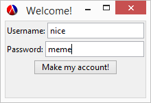

##Authors
Tyler Alterio

Mike Overy

Matt Wolf

##Overview
The Dank Bank: A banking application using cryptography to store your precious memes and lambdas

##Screenshots



##Concepts Demonstrated
Identify the OPL concepts demonstrated in your project. Be brief. A simple list and example is sufficient. 
* **Object Oriented Programming** was used to implement the bank account class which holds user info and account balance, and provides ways of withdrawing and depositing money.
* Password ciphertext is computed using ascii characters stored in **recursive data structures**

##External Technology and Libraries
* We used the racket **GUI library** to create the GUI for the application.
* A **SQL database** is used to store each user's info persistently
* **Ascii character encoding** manipulation was used for password processing

##Favorite Lines of Code
####Matt (@mattwollf)
My favorite lines of code are the Vigenere cipher text generating function. The keylist defined generates a keylist from the keyword which matches the length of the password. The function body uses `map` and `foldr` to apply the vigenere cipher to concisely apply the vigenere cipher with the keylist to the password, and convert the resulting cipher text back to a string.
```scheme
(define (vigenere-cipher password keyword method)
  (define (folder-proc a b result)
    (cons (shift a b method) result))
  (define keylist (gen-v-key (string-length password) keyword))
  (list->string (map chr (foldr folder-proc '() (map ord (string->list password)) keylist))))
```
####Tyler (@tyalt1)
My favorite lines of code are the function that inserts into the database. It takes an account and extracts its username, password, and account, then adds it to the database. The way the SQL query is written, the function can be used to add a new account and change an exsisting account. 

```scheme
(define (insert-to-db account)
  (let ((username (account 'get-username))
        (password (account 'get-password))
        (balance  (account 'get-balance)))
    (query-exec dbc 
                "REPLACE INTO accounts(login, password, amount) VALUES ($1, $2, $3)"
                username 
                password 
                balance)))
```
####Mike (@movery)
"It's just so simple" - Confucius 2015
```scheme
(define nil '())
```

#How to Download and Run

Open BankClient.rkt in DrRacket and run.

